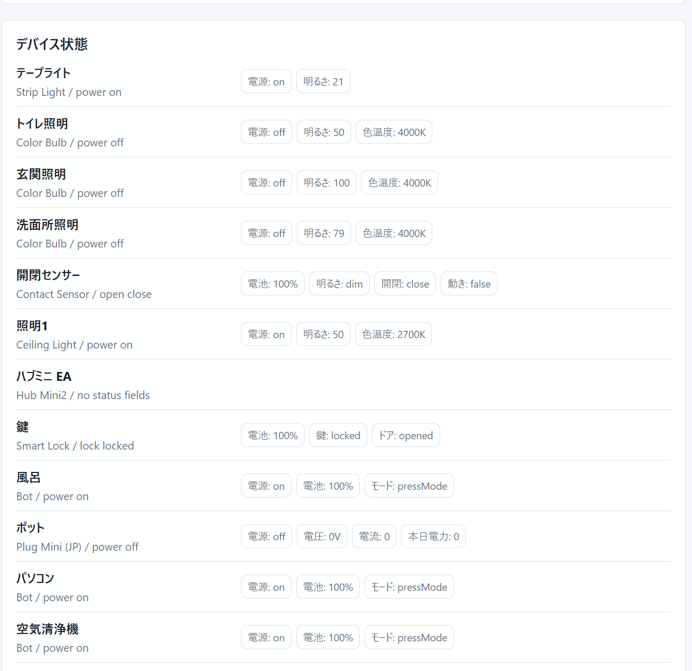
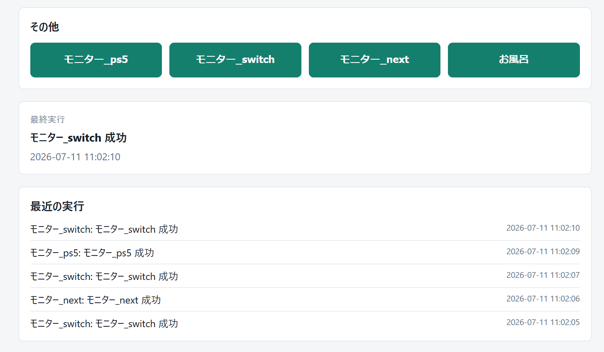
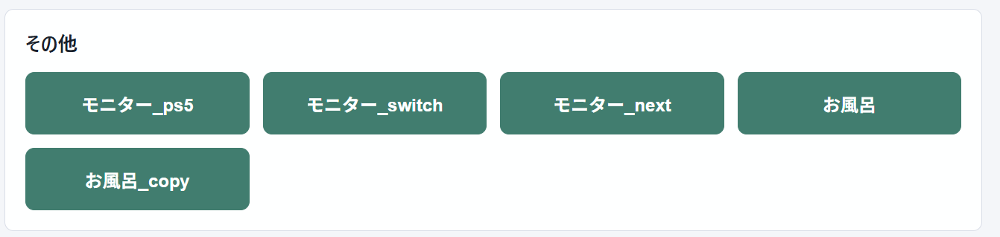
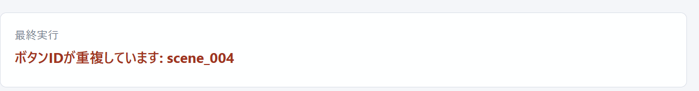
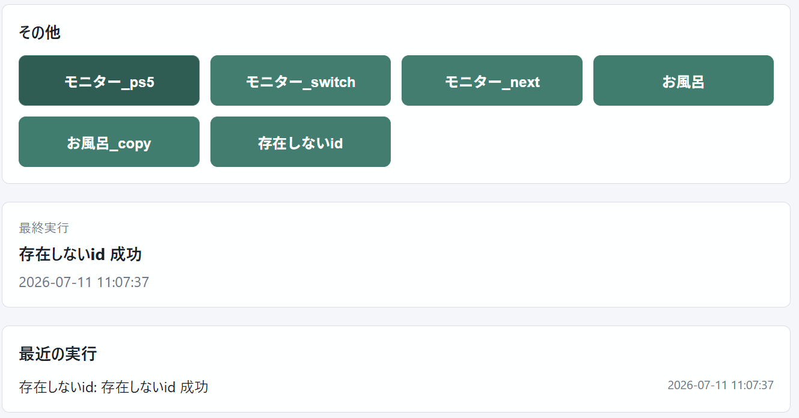

# 手動テストチェックリスト

## 起動

- [〇] PowerShellの実行ポリシーを変更せず `start.cmd` で起動できる
- [〇] 必須ファイルがない場合に `start.cmd` が分かりやすいエラーを表示する
- [〇] `.env` と `config.json` を作成した状態で `.\.venv\Scripts\python.exe -m app` で起動できる
グローバルPythonの `python -m app` は仮想環境の依存関係を参照しないため、テスト対象を仮想環境Pythonへ修正。
PS C:\Users\elega\Documents\CD開発フロー\projects\ローカル自動化ミニアプリ> python -m app
Traceback (most recent call last):
  File "<frozen runpy>", line 203, in _run_module_as_main
  File "<frozen runpy>", line 88, in _run_code
  File "C:\Users\elega\Documents\CD開発フロー\projects\ローカル自動化ミニアプリ\app\__main__.py", line 1, in <module>
    from app.main import run
  File "C:\Users\elega\Documents\CD開発フロー\projects\ローカル自動化ミニアプリ\app\main.py", line 6, in <module>
    import uvicorn
ModuleNotFoundError: No module named 'uvicorn'
PS C:\Users\elega\Documents\CD開発フロー\projects\ローカル自動化ミニアプリ>
- [〇] `http://127.0.0.1:8765` をブラウザで開ける
- [〇] `.env`と保存済み認証情報がない初回起動で入力画面が表示される
- [ ] 誤ったOpen TokenまたはSecret Keyは保存されず、入力画面にエラーが表示される
- [〇] 正しい認証情報を保存すると通常画面へ切り替わる
- [〇] 再起動後も入力不要でWindows資格情報から接続できる
- [ ] 初回設定後もポータブルフォルダとZIPにToken・Secretが生成されない

2026-07-22、Downloadsへ新規展開したポータブル版で初回入力画面を確認。
正しいOpen TokenとSecret Keyの保存後、そのまま通常画面へ切り替わり、デバイス情報を取得できることを確認。
アプリを閉じて同じ`start.cmd`から再起動し、認証情報の再入力なしで通常画面が表示されることを確認。

## 操作

- [〇] デバイス状態がシーンより上に表示される
- [〇] 固定device commandボタンが重複表示されない
- [〇] pressModeのBotを「押す」で操作できる
- [〇] デバイスの部屋・アイコン・操作ロックを保存できる
- [〇] 操作ロック中のデバイス操作が拒否される
同名の部屋ごとにグルーピングされること、選択・保存したアイコンが反映されることを確認。
操作ロック中は実機操作されず、デバイス操作APIが `400 Bad Request` を返すことを確認。
- [〇] 部屋を先に作成し、デバイスで選択できる
- [〇] 部屋が `config.json` の `rooms` 順で固定表示される
- [〇] 編集モードの上下ボタンで部屋順を変更し、再起動後も維持される
- [〇] 新しい部屋が補完部屋を含む一覧の末尾へ追加される
- [〇] 部屋の追加・移動・削除が画面へ先に反映され、保存中は重複操作できない
- [〇] 部屋の三点メニューから上移動・下移動・削除ができる
- [〇] 空の部屋を削除できる
- [〇] デバイスがある部屋を削除すると、デバイスが未分類へ移動する
- [〇] 部屋削除後もアイコン・ロック・マイセットが維持される
- [〇] 「未分類」は削除できない
- [〇] 左側のSVGアイコンから種類を選ぶと即時保存される
- [〇] 右端のロックアイコンでロック・解除を即時切り替えできる
- [〇] 部屋・アイコン・ロック変更に保存ボタンが不要
- [〇] ON/OFFが現在状態を示す1つのトグルとして表示される
- [〇] デバイスが部屋ごとのカードで表示される
- [〇] 通常モードでは日常操作、編集モードでは部屋・アイコン設定が表示される
- [〇] 編集モードでデバイスを非表示にすると一覧から消え、SwitchBot本体とローカル設定は削除されない
- [〇] 「機器・シーン設定」の非表示デバイス一覧から表示へ戻せる
- [〇] 成功・失敗がトーストで表示され、履歴を折りたためる
- [〇] シーンがデバイスより上に表示される
- [〇] シーンをロックするとサーバー側でも実行が拒否される
- [〇] クイック操作のベースアイコンを変更し、再読み込み後も維持される
- [〇] クイック操作へ上下・ON/OFFなどの操作バッジを組み合わせられる
- [〇] クイック操作のアイコン設定メニューにアイコン・バッジ一覧が視覚表示される
- [ ] 編集モードでクイック操作グループを追加し、シーンと赤外線クイック操作の選択肢へ表示される
- [ ] 「表示設定」で登録済みグループを選ぶと即時保存され、同名グループへ移動する
- [ ] グループの三点メニューから並べ替え・削除でき、削除したグループの操作は「シーン」へ移動する
- [ ] クイック操作の件数付きグループ見出しから折りたたみ・展開でき、再読み込み後も状態が維持される
- [ ] 編集モードの「削除・除外」ボタン文字が縦方向中央に表示される
クイック操作のシーンロックは、保存ボタンなしで即時に表示・操作状態へ反映されることを確認。
- [〇] 最新一覧にないシーン・デバイス設定を選択して削除できる
- [〇] Color BulbのRGB色と色温度を変更できる
- [〇] Ceiling Lightの色温度を変更できる
- [〇] Strip LightのRGB色を変更できる
- [〇] 「＋ マイセット」でカード内に名前入力欄が表示される
- [〇] 現在の明るさ・RGB色または色温度をマイセットとして保存できる
- [〇] 保存したマイセットを押すと設定がデバイスへ反映される
- [〇] マイセットに明るさ・RGB色・色温度の内容が表示される
- [〇] 同名のマイセット追加時に上書き確認が表示される
- [〇] 編集モードでマイセット名と設定内容を変更できる
- [〇] 編集モードでのみ表示されるマイセット右側の「×」から確認後に削除できる
- [〇] ロック中の操作ボタンは押せず、ホバーしても操作可能時の色へ変化しない
- [〇] ライト／ダークモードを切り替え、再読み込み後も選択が維持される
- [〇] デバイス操作中は対象カード内に操作内容が表示され、他の操作を受け付けない
- [〇] デバイス操作成功後は対象カード内に成功内容が表示される
- [〇] デバイス操作失敗後は対象カード内にエラーが表示される
- [〇] 明るさ・色・色温度の操作失敗時に入力表示が操作前の値へ戻る
- [〇] `SWITCHBOT_FORCE_CONTROL_ERROR=true` では実機が動作せず、安全に失敗表示を確認できる
テープライト操作が `POST /api/devices/0C4EA0313D92/control` の400 Bad Requestになることを画面とサーバーログで確認。4回の操作に対して4件のリクエストであり、重複送信なし。

強制エラー・400応答確認録画: `20260718-2221-26.4657968.mp4`

確認録画: [20260713-2207-35.6161885.mp4](test-recordings/20260713-2207-35.6161885.mp4)

削除確認録画: [20260713-2213-52.0932879.mp4](test-recordings/20260713-2213-52.0932879.mp4)

編集モード表示確認録画: [20260713-2221-02.5934107.mp4](test-recordings/20260713-2221-02.5934107.mp4)

通常操作フィードバック確認録画: [20260717-0027-00.2928266.mp4](test-recordings/20260717-0027-00.2928266.mp4)

操作失敗・実機非動作確認録画: [20260717-0030-12.9239229.mp4](test-recordings/20260717-0030-12.9239229.mp4)

ダークモード・マイセット設定値表示確認録画: `20260718-1352-01.5127959.mp4`

部屋編集・操作UI確認録画: `20260718-1357-34.0699264.mp4`

部屋削除・未分類移動・設定維持確認録画: `20260718-2033-51.8737774.mp4`

部屋即時反映・クイック操作アイコン確認録画: `20260718-2059-43.8115033.mp4`

クイック操作アイコン一覧確認録画: `20260718-2112-49.4652183.mp4`

デバイス操作先行反映確認録画: `20260718-2142-54.3015498.mp4`

先行反映・送信中ロック・失敗時復元・履歴安定表示の確認録画:
`20260718-2303-47.7398722.mp4`、`20260719-0022-44.1405256.mp4`、
`20260719-0023-35.1255264.mp4`、`20260719-0024-21.7700082.mp4`

最新一覧にないダミーシーン設定の削除確認録画: `20260719-0035-50.0033974.mp4`

補足: ON/OFFを繰り返した際、照明1のカードが一時的に消えて戻る事象を確認。個別状態取得失敗時にカードが成功一覧から外れる実装が原因と判断し、直前状態を保持するよう修正。

補足: 部屋作成、デバイスのアイコン変更、デバイスのロック切替は保存ボタンなしで反映されるが、画面反映まで数秒かかる場合がある。クイック操作のシーンロックは即時反映される。部屋の後半への移動操作は、ブラウザ内の部屋一覧が古いまま残る問題を修正し、再確認済み。
- [〇] デバイス状態一覧から照明をON/OFFできる
- [〇] デバイス状態一覧から照明の明るさを1～100%で変更できる
- [〇] 照明の電源・明るさ・色・色温度が、重複する状態ピルなしで統一行表示される
- [ ] デバイスカードの機器種別が日本語表示され、元のAPI種別はホバー時の補足として確認できる
- [ ] 横幅の広いカードでも明るさ・色温度スライダーが長くなりすぎず、値との対応が分かりやすい
- [〇] 照明カードが2列幅を保ち、状態の日本語化・2段スライダー・控えめな補助情報で表示される
- [〇] 明るさ変更後に最新状態が画面へ反映される
- [〇] 明るさ変更直後にスライダーが変更前の値へ戻らない
- [〇] ON/OFF・明るさ・色・色温度が操作受付直後に画面へ先行反映される
- [〇] デバイス操作の送信中は対象カードが無効化され、連続操作できない
- [〇] デバイス操作APIが失敗した場合、先行反映した表示が操作前へ戻る
- [〇] 状態APIが古い値を返している間も送信した明るさを保持する
- [〇] 実行履歴追加時に画面が大きく動かない
- [〇] 画面から最新のシーン・デバイス候補を取得できる
- [〇] 選択した候補だけが既存設定を残して追加される
- [〇] 設定追加後、再起動すると新しいボタンが表示される
画面からデバイス候補を追加し、再起動後に「デバイス」グループへON/OFFボタンが表示されることを確認。

### シーン同期・除外

- [ ] 起動時に候補が自動取得され、未追加シーンがある場合だけクイック操作上部へ件数が表示される
- [ ] 「すべて追加」で未追加シーンだけが即時にクイック操作へ追加される
- [ ] 「個別に選ぶ」から編集モードの候補一覧へ移動し、選択したシーンだけを追加できる
- [〇] 編集モードで既存シーンを「削除・除外」すると、クイック操作から消えて除外済み一覧へ表示される
- [〇] 候補を再取得またはアプリを再起動しても、除外したシーンが追加候補へ戻らない
- [〇] 「除外解除」後に、自動追加OFFなら追加候補へ戻り、ONなら取得可能なシーンが即時追加される
- [ ] 「新しいシーンを自動追加」を有効にすると未追加シーンが即時追加され、再起動後も設定が維持される
- [ ] 自動追加・削除・除外によって、デバイス設定と手動登録した赤外線クイック操作が変更されない
- [ ] SwitchBot側で取得できなくなった既存設定は自動削除されず、「取得できない設定」に残る

2026-07-22、「お風呂_copy」と実在シーンで削除・除外を確認。除外は自動追加より優先され、
自動追加ONのまま実在シーンを除外解除すると即時にクイック操作へ戻ることを確認。
API一覧にない手動作成シーンでも、今後の削除時は表示名を除外設定へ保存する。
- [〇] `group` ごとに操作ボタンがまとまって表示される

`config.json` に `group` を設定し、「モニター」「お風呂」「テスト」のグループ表示を確認。
- [〇] 操作の成功・失敗が直近5件まで新しい順に表示される

6件以上実行しても表示は5件のみ
- [〇] 設定ファイルに定義したボタンが表示される

→ OK
※ちなみに

→ すごい雑にボタン複製したらちゃんとエラー
- [〇] device commandのボタンで実機が動作する
「洗面所照明 OFF」を実行し、成功表示と実機動作を確認。
- [〇] sceneのボタンでシーンが実行される
- [〇] 成功時に画面へ成功メッセージと時刻が表示される

## 赤外線リモコン

- [〇] エアコンの専用UIで「設定を送信」すると実機へ反映される
- [〇] エアコンのONクイック操作を登録・実行し、実機がONになる
- [〇] エアコンのOFFクイック操作を登録・実行し、実機がOFFになる
- [〇] 編集モードでエアコンのクイック操作を開き、表示名・グループ・温度・モード・風量・ON/OFFを更新できる
- [〇] 更新したクイック操作を実行すると、編集後の設定が実機へ反映される
- [〇] クイック操作を更新してアプリを再起動しても、編集内容・並び順・ロック状態が維持される
- [〇] クイック操作のアイコン設定で「切替」が中央に表示される
- [〇] エアコンのクイック操作へ「冷房」「暖房」バッジを設定・表示できる

2026-07-21、自宅の実機で設定送信とON/OFFクイック操作を確認。
2026-07-21、登録済みクイック操作の編集と、編集後の設定による実機操作を確認。
2026-07-21、アプリ再起動後も編集内容が保持されることを確認。
2026-07-21、「切替」の位置調整と、冷房・暖房バッジの表示を確認。

### その他の赤外線リモコン

- [〇] エアコン以外は直接操作UIを表示せず、SwitchBotシーン経由の操作として区別される
- [〇] シーンに登録した「扇風機電源」を実行できる
- [〇] シーンに登録した「扇風機風量」を実行できる

2026-07-21、学習済みボタン一覧をAPIから取得できないため直接操作対象外とし、
SwitchBotシーン経由で扇風機電源・風量を操作できることを確認。

## エラー

- [〇] `python -m app.validate_config` が存在しないscene/device IDを検出する
実設定では検証成功を確認。別の一時設定で未知のscene/device IDがそれぞれ表示され、終了コード1になることを確認。
- [-] 存在しないdevice_idでエラーが表示される
jsonに記入してみたが特に表示されなかったので判断できず
- [〇] 存在しないscene_idでエラーが表示される
シーン実行前に最新シーン一覧を照合し、存在しない場合は実行APIを呼ばずエラーにする回帰テストを追加。

- [-] ネットワーク不通時にアプリが落ちない
有線接続の場合はネットワーク切ることできる？
- [〇] 状態の再取得に失敗しても直前の状態表示が消えない
テープライトで状態取得失敗時にもカード、直前の電源・明るさ・色、マイセットが維持され、警告が表示されることを確認。
- [〇] 未定義のボタンIDをAPIに送った場合に404が返る
`POST /api/actions/not_defined_test_button` が404と未定義ボタンIDの詳細を返すことを確認。
検証コマンドが欲しいかな
